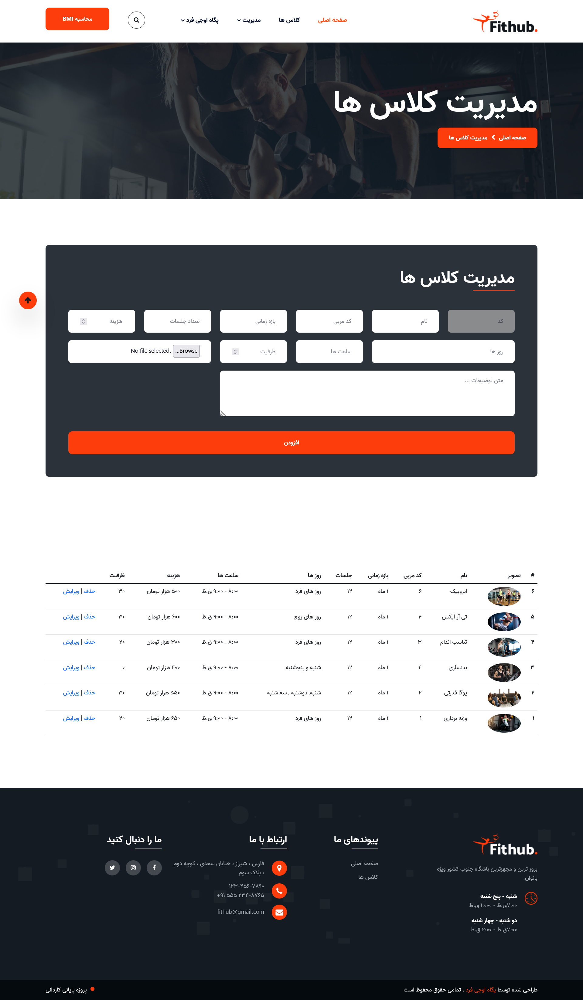

### ّFithub is a website with vanilla php for practicing PHP

###### Technologies

- HTML,Css
- jQuery
- slick slider
- Fonnt Awesome
- PHP

###### What it does

- Has two types of users (admin and public)
- Signup , Login
- Showing classes and their detailes
- Managing classes (add,delete,edit)
- Searching between classes
- Calculating BMI

###### Install

Nothing too fancy just import the db and run it on your host :)

###### Code Description Video

[Description Video](https://drive.google.com/file/d/1jTG69fDx7YH54qJ9KguX8_elSeoDI1Cf/view?usp=share_link).

###### Images

Index

Manage-Class

